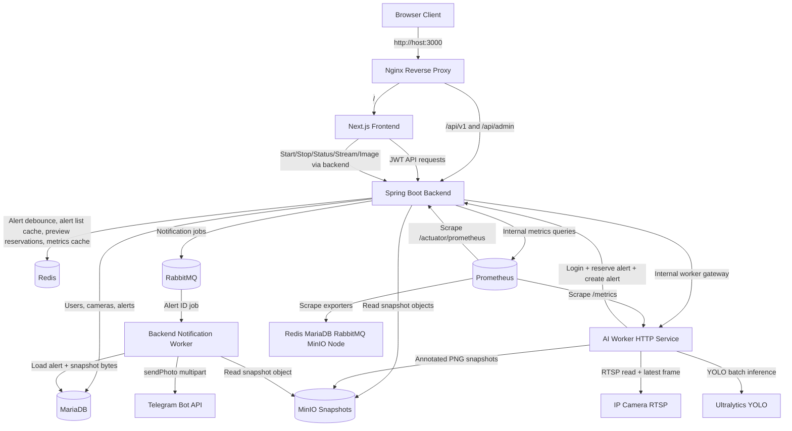

<div align="center">

# FireSafe

**Local-first fire and smoke monitoring system with RTSP preview, YOLO detection, alert notifications, and operational metrics.**


[Overview](#overview) · [System Flow](#system-flow) · [Quick Start](#quick-start) · [Pipelines](#application-pipelines) · [Deployment](#deployment-profiles) · [Repository Map](#repository-map) · [Docs](#docs-index)

</div>

---

## Overview

FireSafe is an operations-focused monitoring platform for IP cameras. It lets an admin register RTSP cameras, start AI fire/smoke detection, reserve live MJPEG preview streams only when the system has capacity, store annotated snapshots, send Telegram photo alerts, and monitor backend/worker/infrastructure health through Prometheus-backed dashboard APIs.

| Component | Tech Stack | Current State |
|---|---|---|
| **Backend API** | Spring Boot 3.5, Java 21, Spring Security, JPA, Flyway | Implemented: JWT auth, authenticated full-access APIs, camera CRUD, alert ingestion, Redis debounce/reservations/list cache, RabbitMQ notification jobs, Telegram photo alerts, MinIO snapshot cleanup, metrics aggregation |
| **Frontend UI** | Next.js 16, React 19, TypeScript, CSS variables | Implemented: login/register, dashboard, alerts, alert detail, camera management, preview capacity flow, camera detail stream page, logs/admin users screens |
| **AI Worker** | Python, OpenCV/FFmpeg, Ultralytics YOLO, PyTorch CPU wheels | Implemented: RTSP shared source reader, Hikvision substream fallback, MJPEG stream endpoint, cross-camera inference scheduler, sustained detection, MinIO upload, backend alert reserve/create |
| **Offline Debug Tool** | Python, Ultralytics, OpenCV | Implemented: local video/image YOLO debug runner under `video-detect/` |
| **Infrastructure** | Docker Compose, Nginx, MariaDB, Redis, RabbitMQ, MinIO, Prometheus/exporters | Implemented: single Nginx app entrypoint, hidden internal app services, localhost-bound admin tools, node-exporter host metrics configuration for Linux native deployments |

---

## System Flow


```mermaid
flowchart TD
    User[Browser Client] -->|http://host:3000| Nginx[Nginx Reverse Proxy]
    Nginx -->|/| Frontend[Next.js Frontend]
    Nginx -->|/api/v1 and /api/admin| Backend[Spring Boot Backend]

    Frontend -->|JWT API requests| Backend
    Frontend -->|Start/Stop/Status/Stream/Image via backend| Backend

    Backend -->|Users, cameras, alerts| MariaDB[(MariaDB)]
    Backend -->|Alert debounce, alert list cache, preview reservations, metrics cache| Redis[(Redis)]
    Backend -->|Notification jobs| RabbitMQ[(RabbitMQ)]
    Backend -->|Internal metrics queries| Prometheus[(Prometheus)]
    Backend -->|Internal worker gateway| Worker[AI Worker HTTP Service]
    Backend -->|Read snapshot objects| MinIO[(MinIO Snapshots)]

    Worker -->|Login + reserve alert + create alert| Backend
    Worker -->|Annotated PNG snapshots| MinIO
    Worker -->|RTSP read + latest frame| RTSP[IP Camera RTSP]
    Worker -->|YOLO batch inference| YOLO[Ultralytics YOLO]

    RabbitMQ -->|Alert ID job| NotificationWorker[Backend Notification Worker]
    NotificationWorker -->|Load alert + snapshot bytes| MariaDB
    NotificationWorker -->|Read snapshot object| MinIO
    NotificationWorker -->|sendPhoto multipart| Telegram[Telegram Bot API]

    Prometheus -->|Scrape /actuator/prometheus| Backend
    Prometheus -->|Scrape /metrics| Worker
    Prometheus -->|Scrape exporters| Infra[Redis MariaDB RabbitMQ MinIO Node]
```

---

## Quick Start

All commands must be executed from the repository root.

### 1. Centralized Environment Configuration

Create a local runtime environment file from the committed example:

```powershell
Copy-Item .env.example .env
```

```bash
cp .env.example .env
```

Adjust camera, Telegram, model, and port values as needed before starting the stack.

### 2. Start Infrastructure and Services

```powershell
docker compose up --build -d
```

```bash
docker compose up --build -d
```

### 3. Open the Application

```text
http://localhost:3000
```

The default admin account is seeded for development:

```text
Email:    admin@nhattienchung.vn
Password: admin123
```

### 4. Verify Runtime Health

```powershell
docker compose ps
Invoke-WebRequest http://localhost:3000/health -UseBasicParsing
Invoke-RestMethod http://localhost:3000/actuator/health
```

```bash
docker compose ps
curl http://localhost:3000/health
curl http://localhost:3000/actuator/health
```

### 5. Verify Admin Metrics

Prometheus is exposed as a localhost-only admin UI on `http://localhost:7005`. The application dashboard does not call Prometheus directly; it calls the backend metrics endpoint with an authenticated JWT.

```text
GET http://localhost:3000/api/admin/metrics
```

---

## Manual Start (Local Development)

Docker Compose is the supported runtime. Use manual mode only when debugging a specific service outside containers.

### 1. Start Infrastructure Dependencies

```bash
docker compose up -d mariadb redis rabbitmq minio prometheus redis-exporter mysqld-exporter node-exporter
```

### 2. Start Backend API

```powershell
cd backend
.\mvnw.cmd spring-boot:run
```

```bash
cd backend
./mvnw spring-boot:run
```

* Swagger UI: `http://localhost:8080/swagger-ui.html`

### 3. Start Frontend UI

```bash
cd frontend
npm install
npm run dev
```

* Development URL: `http://localhost:3000`

### 4. Start AI Worker

```powershell
cd ai-worker
python -m venv venv
.\venv\Scripts\python.exe -m pip install -r requirements.txt
.\venv\Scripts\python.exe -m src.main --port 8090 --backend-url http://localhost:8080 --minio-url localhost:9000
```

```bash
cd ai-worker
python3 -m venv venv
./venv/bin/python -m pip install -r requirements.txt
./venv/bin/python -m src.main --port 8090 --backend-url http://localhost:8080 --minio-url localhost:9000
```

Place model weights under `ai-worker/models/` or pass `--model`.

### 5. Run Offline Video Detection

```powershell
.\video-detect\run-video-detect.ps1 --source path\to\video.mp4 --save
```

```bash
./video-detect/run-video-detect.sh --source path/to/video.mp4 --save
```

---

## Application Pipelines

### Authentication and User Activation

| Step | Component | Action |
|---:|---|---|
| 1 | Browser UI | User logs in or registers with `@nhattienchung.vn` email |
| 2 | Backend | Login returns JWT; registration creates an inactive full-access account pending activation |
| 3 | Users UI | Authenticated users can activate or disable other accounts |
| 4 | Frontend | Stores JWT client-side and sends Bearer token for protected APIs |
| 5 | Spring Security | Requires JWT authentication for protected APIs |

### Detection and Preview Capacity

| Step | Component | Action |
|---:|---|---|
| 1 | `/cameras` page | Admin clicks `Start Detect` |
| 2 | Backend | Checks `/api/v1/detection/capacity`: CPU threshold and GPU threshold if a GPU exporter exists |
| 3 | AI Worker | Starts or reuses shared RTSP source, registers camera in inference scheduler |
| 4 | `/cameras` page | User clicks `Mở stream` only after detection has a frame |
| 5 | Backend | Checks preview CPU threshold and creates Redis preview reservation |
| 6 | Frontend | Renders MJPEG stream while reservation is valid; `/cameras/{id}` can open for any camera, but its large stream renders only with an active reservation and worker frame |

### Real-Time Alert Pipeline

| Step | Component | Action |
|---:|---|---|
| 1 | AI Worker | Reads RTSP frames through shared `SharedRtspSource` |
| 2 | Inference Scheduler | Builds cross-camera partial batches up to `AI_WORKER_BATCH_MAX_SIZE` |
| 3 | YOLO Detector | Detects configured alert labels such as `fire` and `smoke` |
| 4 | Camera Worker | Requires sustained detection window before sending alert |
| 5 | Backend | Reserves Redis debounce slot before snapshot upload |
| 6 | AI Worker | Uploads annotated PNG snapshot to MinIO and creates alert |
| 7 | Backend | Saves alert in MariaDB, finalizes debounce, evicts alert list cache, publishes RabbitMQ notification job after commit |
| 8 | Notification Worker | Sends Telegram `sendPhoto` alert with snapshot bytes read from MinIO |

### Observability Pipeline

| Step | Component | Action |
|---:|---|---|
| 1 | Prometheus | Scrapes backend, AI Worker, Redis, MariaDB, RabbitMQ, MinIO, and node-exporter |
| 2 | Backend | Queries Prometheus internally and merges DB business counters |
| 3 | Redis | Caches admin metrics snapshot for 10 seconds |
| 4 | Frontend Dashboard | Calls `/api/admin/metrics` with admin JWT |
| 5 | Logs Page | Polls backend `/api/admin/worker/monitoring/summary`; backend reads AI Worker internally |

---

## Deployment Profiles

| Profile | Entry Point | Description | Host Port |
|---|---|---|---|
| **Nginx App Gateway** | `infra/nginx/default.conf` | Routes frontend, backend API, Swagger/Actuator health, and authenticated MJPEG stream gateway | `0.0.0.0:3000` |
| **Backend API** | `backend/` | Spring Boot API, security, DB access, alert workflow, worker/MinIO gateway, metrics aggregation | Internal `8080` |
| **Frontend UI** | `frontend/` | Next.js operations dashboard and route screens | Internal `3000` |
| **AI Worker** | `ai-worker/` | RTSP reader, MJPEG stream, YOLO inference, alert upload/post; internal only behind backend gateway | Internal `8090` |
| **MariaDB** | `docker-compose.yml` | Main relational database | Internal `3306` |
| **Redis** | `docker-compose.yml` | Alert debounce, alert list cache, preview reservations, metrics cache | Internal `6379` |
| **RabbitMQ** | `docker-compose.yml` | Notification job queue and management UI | UI `127.0.0.1:7004` |
| **MinIO** | `docker-compose.yml` | Snapshot object storage and console UI | Console `127.0.0.1:7002` |
| **Prometheus** | `infra/prometheus/prometheus.yml` | Metrics collector and query UI | UI `127.0.0.1:7005` |
| **Adminer** | `docker-compose.yml` | MariaDB admin UI | `127.0.0.1:7001` |
| **RedisInsight** | `docker-compose.yml` | Redis inspection UI | `127.0.0.1:7003` |

---

## Repository Map

```text
.
├── backend/                         Spring Boot API
│   ├── Dockerfile
│   ├── pom.xml
│   └── src/main/
│       ├── java/com/firesafe/backend/
│       │   ├── configs/             Security, RabbitMQ, OpenAPI, seed config
│       │   ├── controllers/         Auth, cameras, alerts, users, metrics, capacity APIs
│       │   ├── dtos/                API request/response contracts
│       │   ├── middlewares/         JWT filter
│       │   ├── models/              JPA entities
│       │   ├── repositories/        Spring Data repositories
│       │   ├── services/            Business workflows and integrations
│       │   └── utils/               JWT and exception handling helpers
│       └── resources/
│           └── db/migration/        Flyway migrations
│
├── frontend/                        Next.js operations UI
│   ├── Dockerfile
│   ├── package.json
│   └── src/
│       ├── app/                     App Router routes
│       ├── features/                Auth, dashboard, cameras, alerts, logs, admin users
│       ├── layouts/                 Shared navigation shell
│       └── shared/                  HTTP/auth utilities
│
├── ai-worker/                       RTSP preview and YOLO detection service
│   ├── Dockerfile
│   ├── requirements.txt
│   └── src/
│       ├── controllers/             HTTP routes, status, stream, metrics
│       ├── services/                RTSP source, camera worker, detector, scheduler
│       ├── repositories/            Backend and MinIO clients
│       ├── configs/
│       └── utils/
│
├── video-detect/                    Offline YOLO debug CLI
│   ├── detect_video.py
│   ├── requirements.txt
│   ├── run-video-detect.ps1
│   ├── run-video-detect.sh
│   └── src/
│
├── docs/
│   └── explanations/                Architecture and implementation explanations
│
├── infra/
│   ├── mariadb/                     MariaDB runtime tuning config
│   ├── nginx/                       Reverse proxy config
│   ├── prometheus/                  Prometheus scrape config
│   ├── rabbitmq/                    RabbitMQ config, plugins, definitions
│   └── redis/                       Redis persistence/cache policy config
│
├── docker-compose.yml               Full-stack runtime
├── .env.example                     Committed environment template
└── README.md
```

---

## Docs Index

Detailed architecture documents are maintained under `docs/explanations/`:

| Document | Purpose |
|---|---|
| [**`backend-explanation.md`**](docs/explanations/backend-explanation.md) | Spring Boot package structure, API contracts, security, alert workflow, capacity services |
| [**`frontend-explanation.md`**](docs/explanations/frontend-explanation.md) | Next.js App Router, feature modules, screens, camera/alert/dashboard behavior |
| [**`ai-worker-explanation.md`**](docs/explanations/ai-worker-explanation.md) | RTSP source sharing, MJPEG preview, YOLO inference scheduler, alert upload/post flow |
| [**`video-detect-explanation.md`**](docs/explanations/video-detect-explanation.md) | Offline image/video model debugging CLI |
| [**`infrastructure-explanation.md`**](docs/explanations/infrastructure-explanation.md) | Docker Compose, Nginx, Prometheus/exporters, ports, volumes, runtime notes |

---

## Service Credentials Reference

Default values are for local development only. Override them before any real deployment.

| Service | URL / Port | Username | Password / Notes |
|---|---|---|---|
| **Nginx App** | `http://localhost:3000` | — | Login through Web UI |
| **Default Admin** | Web UI | `admin@nhattienchung.vn` | `admin123` |
| **Swagger UI** | `http://localhost:3000/swagger-ui.html` | — | Use backend JWT Bearer token |
| **Adminer** | `http://localhost:7001` | `firesafe` | Server: `mariadb`, password from environment |
| **MinIO Console** | `http://localhost:7002` | `minioadmin` | `minioadmin` |
| **RedisInsight** | `http://localhost:7003` | — | Connect to Redis host `redis` |
| **RabbitMQ Management** | `http://localhost:7004` | `guest` | `guest` |
| **Prometheus UI** | `http://localhost:7005` | — | Localhost-bound admin tool |

---

## Architecture Accuracy Notes

- **Single Public App Entry Point**: Browser traffic enters through Nginx on port `3000`. Backend and AI Worker ports are not published directly to the host.
- **Internal Prometheus Access**: The dashboard calls backend `/api/admin/metrics`; backend queries Prometheus inside the Docker network and caches the normalized snapshot in Redis.
- **Capacity Gates Are Separate**: Detection capacity checks CPU and GPU if GPU metrics exist; preview capacity checks CPU before opening MJPEG streams on the UI.
- **Preview Reservation Controls UI Streaming**: A camera can keep detecting without streaming to the browser. Camera detail pages are navigable for every camera, but the large MJPEG stream renders only when that user has a valid preview reservation and the worker has a frame.
- **Alert Debounce Protects Storage and Notifications**: Backend Redis reservation happens before snapshot upload, so duplicate alert windows skip MinIO, MariaDB, RabbitMQ, and Telegram work.
- **Alert List Cache Is Short-Lived**: Backend caches `GET /api/v1/alerts` list responses in Redis for a short TTL and evicts `alerts:list:*` after alert create/delete commits.
- **Telegram Photo Alerts Upload Bytes**: Notification service reads the MinIO object internally and sends it to Telegram through multipart `sendPhoto`, so deleting a local snapshot later does not remove already-sent Telegram media.
- **Node Metrics Depend on Deployment OS**: On Linux native deployments, node-exporter is configured to read host CPU/RAM/Disk through mounted host paths. On Docker Desktop Windows, it reflects the Docker/WSL2 VM. GPU metrics require a dedicated exporter.
- **Model Weights Are Runtime Artifacts**: YOLO `.pt` files are downloaded or placed at runtime and are not part of source control.
